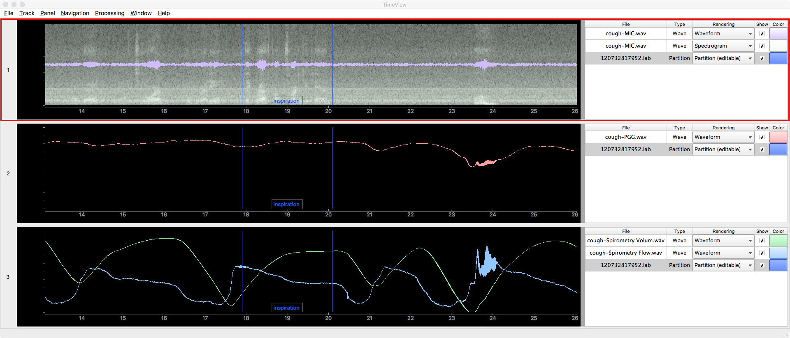

TimeView
=

Overview
-
Timeview is a cross-platform (Windows, MacOS, Linux) desktop application for viewing and editing
Waveforms, Time-Value data, and Segmentation data. 
These data can easily be analyzed or manipulated using a library of built-in processors;
for example, a linear filter can operate on a waveform, or an activity detector can create a segmentation from a waveform.
Processors can be easily customized or created created from scratch.

This is a very early preview, and is not suitable for general usage yet.

Features
-
* *Cross-platform*, verified to run on macOS, Linux, and Windows
* Flexible arrangement of any number of *panels*, 
which contain any number of superimposed *views* (e.g. waveforms, spectrograms, feature trajectories, segmentations)
* Views can easily be *moved* between panels
* Views can be *linked* so that modifications in one panel are reflected in other panels
* *Customizable Rendering* of views (e.g. frame_size for spectrogram)
* *On-the-fly Spectrogram* rendering automatically adjusts frame-rate and FFT-size to calculate information for each available pixel without interpolation
* *Editable segmentation* (insertion, deletion, modification of boundaries; modification of labels)
* Basic *processing plug-ins* are provided (e.g. activity detection, F0-analysis)
* Processing plug-ins are easily *customizable* or *extendable* using python (briding to R via `rpy2` is also possible, an example is provided)
* API allows accessing processing plugins for *batch file processing* or *preconfiguring the GUI* (examples are provided)
* *EDF-file-format* support
* A *dataset-manager* allows grouping of files into datasets, for quick access to often-used files

An introductory video is available at: https://vimeo.com/245480108

Installation
-
Navigate to the "bin" folder, and then to the folder that represents your Operating System.
Ensure your internet connection is live, and then run the "install" script.
Approximately 2 GB of data will be downloaded during installation.
The entire process may take some time, depending on your computer and internet connection.

Advanced users can skip the installation step, and use their own python installation, as long as all requirements in `environment.yml` are satisfied.

Starting the Application
-
After successful installation,
you can start the application by running the TimeView Application Launcher or Script that is in the same folder as the installation script.
(Note that the Application Launcher or scripts should not be moved from their original location; creating shortcuts or links to them should be fine.)
Advanced users can also run the application from the command line, with optional arguments controlling startup behavior;
for usage information, add the "-h" switch.

Help
-
After the application has started, select "Help" from the Menu, and then "TimeView Help" to learn more.
